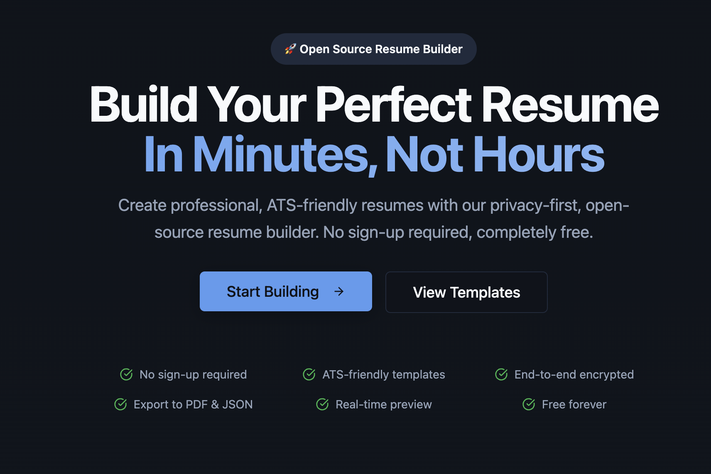
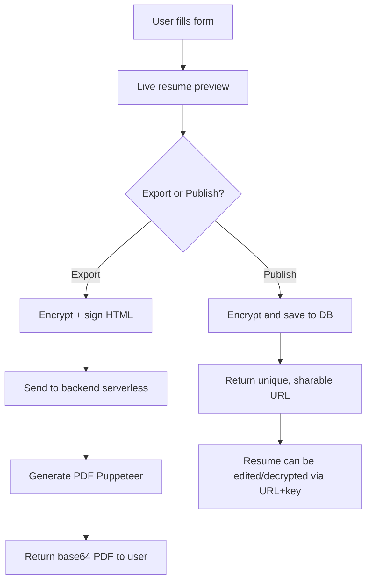
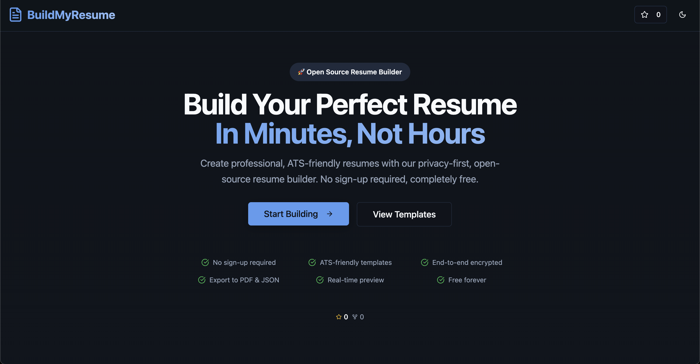
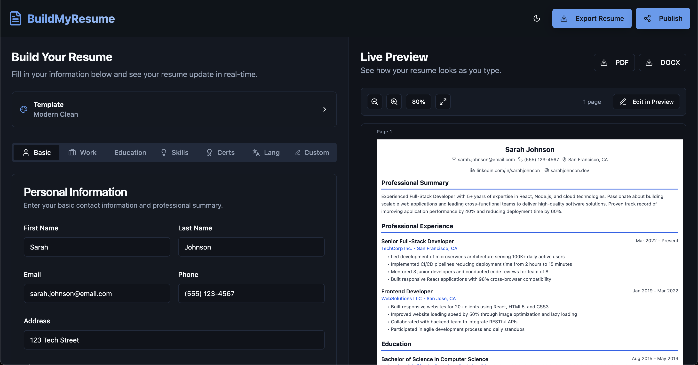

# BuildMyResume

> **BuildMyResume** is a privacy-first, end-to-end encrypted, account-free resume builder created by **Muhammed Rashid V**. Create, publish, and export beautiful resumes from any device — with zero friction and full control over your data.



[](https://buildmyresume.live)
[](https://youtu.be/Q_FjVnEu6Es)

---

## 🚀 Project Overview

**BuildMyResume** is for anyone who wants to build a professional, ATS-friendly resume with AI-powered content enhancement — without creating an account, paying hidden fees, or giving up privacy. Created by [Muhammed Rashid V](https://linkedin.com/in/muhammed-rashid-v).

- **No login required**: Build and download resumes instantly, no sign-up or email needed.
- **Publish for later**: Use the “Publish” feature to get a secure, encrypted link you can revisit from any device.
- **AI-powered enhancement**: Intelligent content improvement with Google Gemini AI for better ATS optimization.
- **End-to-end encrypted**: All resume data is encrypted before storage or export. Only you hold the key.
- **Open source & free forever**: MIT licensed, transparent, and built for the community.

---

## ✨ Features

- 🧩 **Form-based resume builder** — Fill out a structured form and see your resume update in real time.
- 🤖 **AI-powered content enhancement** — Enhance your resume content with AI using Google's Gemini for better ATS optimization and professional language. Get intelligent suggestions for Professional Summary, Job Descriptions, and more.
- 🔐 **Privacy-first** — All data is encrypted before storage or export. No accounts, no tracking.
- 🔄 **Editable preview** — Adjust formatting directly on your resume before exporting.
- 📄 **Export options** — Download as PDF (via encrypted serverless function) or JSON.
- 🔗 **Published resume link** — Get a secure, encrypted link to revisit and edit your resume anytime.
- 📱 **Mobile-friendly UI** — Fully responsive, works beautifully on all devices.
- 🧑‍💻 **Open source** — MIT licensed and built for the community.

---

## 🛠️ Tech Stack

- **Frontend**: React, Tailwind CSS, [shadcn/ui](https://ui.shadcn.com/), [crypto-js](https://github.com/brix/crypto-js), [file-saver](https://github.com/eligrey/FileSaver.js)
- **Backend**: Firebase Functions, Express.js
- **AI Integration**: Google Gemini API
- **PDF Rendering**: [puppeteer-core](https://github.com/puppeteer/puppeteer), [chrome-aws-lambda](https://github.com/alixaxel/chrome-aws-lambda)
- **Security**: AES encryption + HMAC signature (for data integrity), Rate limiting, Input validation

---

## 🏗️ Architecture



- **Build**: Fill out the form, see instant preview, and edit formatting directly.
- **Export**: Resume HTML is encrypted and signed, sent to a serverless backend, rendered to PDF with Puppeteer, and returned as a secure download.
- **Publish**: Resume is encrypted and stored in the cloud. You get a unique, encrypted link to revisit and edit your resume from any device.
- **Access**: When you open a published link, the resume is decrypted in your browser using the embedded key — your data stays private.

---

## 🔒 Technical Details

### End-to-End Encryption

- All resume data is encrypted in the browser using AES (via `crypto-js`).
- When you publish or export, the data is encrypted with a randomly generated key.
- For published resumes, the key is embedded in the URL fragment (`#key=...`), never sent to the server.
- For PDF export, the HTML is encrypted and signed with a shared secret before being sent to the serverless function.

### Publishing & Editing

- Publishing stores the encrypted resume in a database (via Supabase).
- The returned link contains the resume ID and the encryption key.
- Only someone with the link (and key) can decrypt and edit the resume.

### PDF Export

- PDF export is handled by a Firebase Function (or any serverless endpoint) using Puppeteer and headless Chrome.
- The frontend sends encrypted HTML and a HMAC signature.
- The backend verifies the signature, decrypts the HTML, renders it to PDF, and returns a base64-encoded PDF.

---

## ⚙️ Environment Variables

Create a `.env` file in the project root:

```
VITE_EXPORT_API=https://your-cloud-function-url
VITE_API_BASE_URL=https://your-cloud-function-url
VITE_SHARED_SECRET=your-shared-secret
VITE_SUPABASE_URL=https://your-supabase-url
VITE_SUPABASE_ANON_KEY=your-supabase-anon-key
VITE_BASE_URL=http://localhost:8080
VITE_UMAMI_SRC=https://cloud.umami.is/script.js
VITE_UMAMI_WEBSITE_ID=your-umami-website-id
```

### AI Enhancement Setup

For AI content enhancement features, you'll need to set up Google Gemini API:

1. Get a Gemini API key from [Google AI Studio](https://makersuite.google.com/app/apikey)
2. For local development, add to `functions/.env`:
   ```
   GEMINI_API_KEY=your_gemini_api_key_here
   ```
3. For production, set Firebase Functions config:
   ```bash
   firebase functions:config:set gemini.api_key="your_gemini_api_key_here"
   ```

See [AI_SETUP.md](./AI_SETUP.md) for detailed setup instructions.

- `VITE_EXPORT_API`: URL of your deployed PDF export function
- `VITE_API_BASE_URL`: URL of your deployed function
- `VITE_SHARED_SECRET`: Secret used for encrypting/signing PDF export payloads
- `VITE_SUPABASE_URL`: Your Supabase project URL (for published resume storage)
- `VITE_SUPABASE_ANON_KEY`: Your Supabase anon/public API key
- `VITE_BASE_URL`: The base URL of your frontend app (e.g., http://localhost:5173)
- `VITE_UMAMI_SRC`: Umami script URL (cloud or self-hosted). Example: `https://cloud.umami.is/script.js`
- `VITE_UMAMI_WEBSITE_ID`: Your Umami website ID

---

## 📦 Environment Example File

A `.env.example` file is provided in the project root. It lists all required environment variables for both local and Firebase PDF export, as well as Supabase integration.

- Copy `.env.example` to `.env` and fill in your values.
- For local PDF export, set `VITE_EXPORT_API` to `http://localhost:5001/export-pdf`.
- For Firebase/production, set `VITE_EXPORT_API` to your deployed function URL.
- Make sure `VITE_SHARED_SECRET` matches between frontend and backend.

Example:
```env
VITE_SHARED_SECRET=your-shared-secret
VITE_EXPORT_API=http://localhost:5001/export-pdf
VITE_SUPABASE_URL=https://your-supabase-url
VITE_SUPABASE_ANON_KEY=your-supabase-anon-key
VITE_BASE_URL=http://localhost:5173
VITE_UMAMI_SRC=https://cloud.umami.is/script.js
VITE_UMAMI_WEBSITE_ID=your-umami-website-id
```

---

## 📊 Analytics (Umami)

This project uses **Umami** for privacy-friendly analytics.

- Analytics script is loaded dynamically from `src/components/Analytics.tsx`.
- Auto-tracking is disabled, and pageviews are tracked manually on route changes.
- Published resume pages (`/view/:id`) are intentionally **excluded** from analytics to protect user privacy.
- If `VITE_UMAMI_SRC` or `VITE_UMAMI_WEBSITE_ID` are missing, analytics is skipped entirely.

How to set up:
- Create a site in Umami and copy the website ID.
- Set `VITE_UMAMI_SRC` to your Umami script URL (Cloud: `https://cloud.umami.is/script.js` or your self-hosted URL).
- Set `VITE_UMAMI_WEBSITE_ID` to your website ID.

Event tracking:
- The app currently tracks only pageviews (excluding `/view/:id`). You can extend it to track custom events using `window.umami.track(eventName, data)` in your components.

---

## 🖨️ PDF Export: Local Development vs. Firebase

You can run the PDF export backend in two ways:

### 1. Local Development (using full Puppeteer)

For local testing and development, use the full Puppeteer package (no headless Chrome AWS Lambda required):

```sh
cd functions
npm run start:local
```

- The local server will run on [http://localhost:5001/export-pdf](http://localhost:5001/export-pdf)
- This uses your locally installed Chrome/Chromium for PDF generation.

### 2. Firebase Functions (Cloud/Emulator)

For production or cloud emulation, use the Firebase Functions setup (with `puppeteer-core` and `chrome-aws-lambda`):

```sh
cd functions
npm run start:firebase
```

- This runs the Firebase emulator for functions, matching the production environment.

---

## 🎨 Adding New Resume Templates

1. Add your template component to `src/templates/`.
2. Register it in `src/templates/index.ts` and `src/templates/config.ts`.
3. Add a preview image and description.
4. Submit a PR!

---

## 📚 Documentation

For comprehensive documentation, guides, and development information, visit our **[Documentation](./docs/README.md)** folder:

- **[Contributing Guidelines](./docs/CONTRIBUTING.md)** - How to contribute to the project
- **[Template Guide](./docs/TEMPLATE_GUIDE.md)** - How to create and submit new resume templates
- **[Firebase Functions](./docs/FUNCTIONS.md)** - Backend functions documentation and setup
- **[AI Enhancement Guide](./docs/AI_ENHANCEMENT.md)** - AI-powered content enhancement feature documentation
- **[SEO Guide](./docs/SEO_GUIDE.md)** - Search engine optimization guidelines
- **[Security Checklist](./docs/PUBLIC_REPO_CHECKLIST.md)** - Security review and deployment checklist

---

## Contributing Resume Templates

If you want to contribute a new resume template, please read our [Template Authoring Guide](./docs/TEMPLATE_GUIDE.md) for best practices and requirements.

---

## About BuildMyResume

BuildMyResume is a modern, open-source resume builder. Visit [BuildMyResume.live](https://BuildMyResume.live) to try it out or learn more.

---

## 🧑‍💻 Contributing

We welcome contributions of all kinds!

- **Report bugs** — Open an issue if you find a bug or security concern.
- **Submit PRs** — Add new templates, improve UI/UX, or fix issues.
- **Suggest features** — Propose new features or improvements.

See [CONTRIBUTING.md](./docs/CONTRIBUTING.md) for guidelines.

---

## ♿ Accessibility & Browser Support

- Fully keyboard accessible and screen reader friendly.
- Tested on latest Chrome, Firefox, Safari, and Edge.
- Mobile-first, responsive design.

---

## 📸 Screenshots & Demo

- 
- 

**Live Demo:** [BuildMyResume.live](https://buildmyresume.live)
**Video Demo:** [Watch on YouTube](https://youtu.be/Q_FjVnEu6Es)

---

## 📄 License

MIT — free for personal and commercial use. See [LICENSE](LICENSE).

---

**BuildMyResume** — Build, export, and publish your resume with privacy and freedom. No accounts. No friction. Open source forever.

---

**Created by [Muhammed Rashid V](https://linkedin.com/in/muhammed-rashid-v)** — Connect with me on LinkedIn for collaboration opportunities and professional networking.

---
