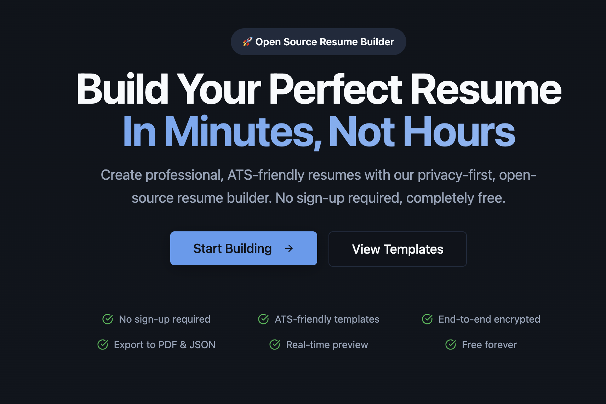
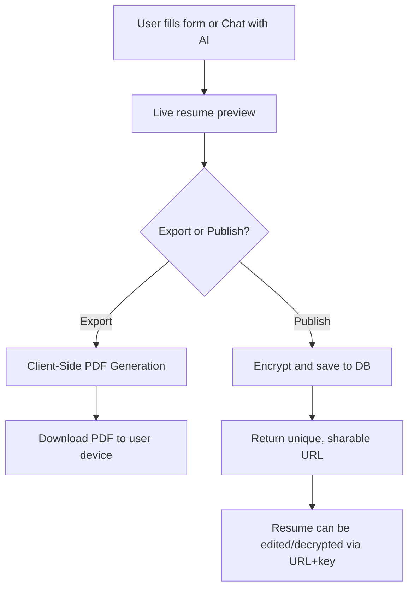
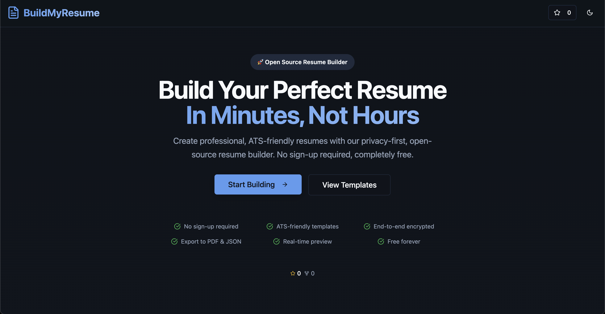
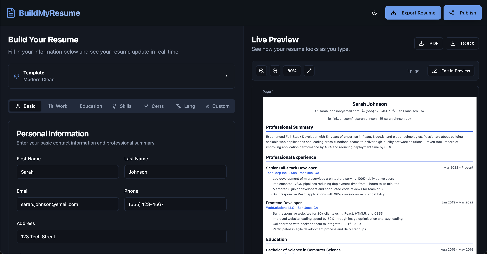

# BuildMyResume

> **BuildMyResume** is a privacy-first, end-to-end encrypted, account-free resume builder created by **Muhammed Rashid V**. Create, publish, and export beautiful resumes from any device — with zero friction and full control over your data.



[](https://build-my-resume-nu.vercel.app/)
[](https://youtu.be/Q_FjVnEu6Es)

---

## 🚀 Project Overview

**BuildMyResume** is for anyone who wants to build a professional, ATS-friendly resume with AI-powered content enhancement — without creating an account, paying hidden fees, or giving up privacy. Created by [Muhammed Rashid V](https://linkedin.com/in/muhammed-rashid-v).

- **No login required**: Build and download resumes instantly, no sign-up or email needed.
- **AI Resume Builder**: Chat with our AI to effortlessly generate a full customized resume from scratch, powered by Puter.js.
- **AI-powered enhancement**: Intelligent content improvement with Google Gemini AI for better ATS optimization.
- **Publish for later**: Use the “Publish” feature to get a secure, encrypted link you can revisit from any device.
- **End-to-end encrypted**: All resume data is encrypted before storage or export. Only you hold the key.
- **Open source & free forever**: MIT licensed, transparent, and built for the community.

---

## ✨ Features

- 🧩 **Form-based resume builder** — Fill out a structured form and see your resume update in real time.
- 🤖 **AI-powered content enhancement** — Enhance your resume content with AI using Google's Gemini for better ATS optimization and professional language. Get intelligent suggestions for Professional Summary, Job Descriptions, and more.
- 🔮 **AI Resume Builder & Puter.js Integration** — We partner with [Puter.js](https://puter.com/) to offer a robust, free-to-use AI resume generation experience that helps you build a resume from scratch securely and boundlessly.
- 🔐 **Privacy-first** — All data is encrypted before storage or export. No accounts, no tracking.
- 🔄 **Editable preview** — Adjust formatting directly on your resume before exporting.
- 📄 **Export options** — Download as high-fidelity PDF (rendered locally in your browser) or export to JSON.
- 🔗 **Published resume link** — Get a secure, encrypted link to revisit and edit your resume anytime.
- 📱 **Mobile-friendly UI** — Fully responsive, works beautifully on all devices.
- 🧑‍💻 **Open source** — MIT licensed and built for the community.

---

## 🤖 AI Resume Builder (Powered by Puter.js)

We've integrated an advanced interactive AI Resume Builder directly into the platform to help you generate a professional resume from a simple prompt or chat conversation. 

- **Built with Puter.js**: We leverage [Puter.js](https://puter.com/) to provide boundless, reliable, and secure AI generation for creating your initial resume draft.
- **Interactive Chat**: You can chat with the AI to refine your experiences, add missing details, and tweak your resume generation.
- **Privacy-focused**: Your prompts and generated data are handled securely and fed directly into your local private editor. 

Once the AI generates your base resume, you can switch to the Editor to manually tweak formatting, add new sections, enhance your fields, and export to PDF.

---

## 🛠️ Tech Stack

- **Frontend**: React, Tailwind CSS, [shadcn/ui](https://ui.shadcn.com/), [crypto-js](https://github.com/brix/crypto-js), [file-saver](https://github.com/eligrey/FileSaver.js)
- **Backend API**: NestJS, Express.js
- **AI Integration**: Google Gemini API via `@google/generative-ai` (for Enhancement) and [Puter.js](https://puter.com) (for AI Builder Chat/Generate)
- **PDF Rendering**: Local high-fidelity print generation via `@react-pdf/renderer` and HTML Printing
- **Security**: AES encryption + HMAC signature (for data integrity), Rate limiting, Input validation

---

## 🏗️ Architecture


```mermaid
flowchart TD
    A[User fills form or Chat with AI] --> B[Live resume preview]
    B --> C{Export or Publish?}
    C -->|Export| D[Client-Side PDF Generation]
    D --> E[Download PDF to user device]
    C -->|Publish| H[Encrypt and save to DB]
    H --> I[Return unique, sharable URL]
    I --> J[Resume can be edited/decrypted via URL+key]
```

- **Build**: Fill out the form, see instant preview, and edit formatting directly.
- **Export**: Generates high-resolution PDFs directly on the client machine using browser native print capabilities alongside React rendering boundaries.
- **Publish**: Resume is encrypted and stored in the cloud. You get a unique, encrypted link to revisit and edit your resume from any device.
- **Access**: When you open a published link, the resume is decrypted in your browser using the embedded key — your data stays private.

---

## 🔒 Technical Details

### End-to-End Encryption

- All resume data is encrypted in the browser using AES (via `crypto-js`).
- When you publish or export, the data is encrypted with a randomly generated key.
- For published resumes, the key is embedded in the URL fragment (`#key=...`), never sent to the server.

### Publishing & Editing

- Publishing stores the encrypted resume in a database (via Supabase).
- The returned link contains the resume ID and the encryption key.
- Only someone with the link (and key) can decrypt and edit the resume.

### PDF Export

- PDF export is securely handled entirely in the browser using the `useReactToPrint` architecture. Your data never needs to round-trip to a third-party server to be styled into a PDF file, keeping you private and your operations extremely fast.

---

## ⚙️ Environment Variables

Create a `.env` file in the project root:

```
VITE_API_URL=http://localhost:4000
VITE_SHARED_SECRET=your-shared-secret
VITE_SUPABASE_URL=https://your-supabase-url
VITE_SUPABASE_ANON_KEY=your-supabase-anon-key
VITE_BASE_URL=http://localhost:5173
VITE_UMAMI_SRC=https://cloud.umami.is/script.js
VITE_UMAMI_WEBSITE_ID=your-umami-website-id
```

### AI Enhancement Setup

For AI content enhancement features, you'll need to set up Google Gemini API inside the `api/` directory:

1. Get a Gemini API key from [Google AI Studio](https://makersuite.google.com/app/apikey)
2. For local backend development, add to `api/.env`:
   ```
   PORT=4000
   GEMINI_API_KEY=your_gemini_api_key_here
   GEMINI_MODEL=gemini-2.5-flash
   ```
3. For production deployment on Vercel, attach `GEMINI_API_KEY` to your Vercel Project Environment Variables directly.

See [API_SETUP.md](./docs/API_SETUP.md) for detailed setup instructions.

*Note: The AI Resume Builder chat feature is powered by [Puter.js](https://puter.com) and authenticates directly on the client side, requiring no extra environment variables!*

- `VITE_API_URL`: URL of your deployed NestJS Backend API Proxy.
- `VITE_SHARED_SECRET`: Secret used for encryption.
- `VITE_SUPABASE_URL`: Your Supabase project URL (for published resume storage).
- `VITE_SUPABASE_ANON_KEY`: Your Supabase anon/public API key.
- `VITE_BASE_URL`: The base URL of your frontend app (e.g., http://localhost:5173).
- `VITE_UMAMI_SRC`: Umami script URL (cloud or self-hosted). Example: `https://cloud.umami.is/script.js`.
- `VITE_UMAMI_WEBSITE_ID`: Your Umami website ID.

---

## 📦 Environment Example File

A `.env.example` file is provided in the project root. It lists all required environment variables.

- Copy `.env.example` to `.env` and fill in your values.
- Make sure `VITE_SHARED_SECRET` matches between frontend and any remote services you connect.

Example:
```env
# Application API
VITE_API_URL=http://localhost:4000
VITE_SHARED_SECRET=your-shared-secret
# Set to 'true' to enable AES encryption for AI Builder payloads (Must also set ENABLE_ENCRYPTION=true on the backend)
VITE_ENABLE_ENCRYPTION=false

# Supabase
VITE_SUPABASE_URL=https://your-supabase-url
VITE_SUPABASE_ANON_KEY=your-supabase-anon-key

# Etc
VITE_BASE_URL=http://localhost:5173
VITE_UMAMI_SRC=https://cloud.umami.is/script.js
VITE_UMAMI_WEBSITE_ID=your-umami-website-id
```

---

## 📊 Analytics (Umami)

This project uses **Umami** for privacy-friendly analytics.

- Analytics script is loaded dynamically from `src/components/Analytics.tsx`.
- Auto-tracking is disabled, and pageviews are tracked manually on route changes.
- Published resume pages (`/view/:id`) are intentionally **excluded** from analytics to protect user privacy.
- If `VITE_UMAMI_SRC` or `VITE_UMAMI_WEBSITE_ID` are missing, analytics is skipped entirely.

How to set up:
- Create a site in Umami and copy the website ID.
- Set `VITE_UMAMI_SRC` to your Umami script URL (Cloud: `https://cloud.umami.is/script.js` or your self-hosted URL).
- Set `VITE_UMAMI_WEBSITE_ID` to your website ID.

Event tracking:
- The app currently tracks only pageviews (excluding `/view/:id`). You can extend it to track custom events using `window.umami.track(eventName, data)` in your components.

---

## 🖨️ Architecture Setup: Local Development vs. Production Deployment

You can run the full dual-app stack in two ways:

### 1. Local Development (Vite + NestJS)

For local testing, boot up both development servers simultaneously:

```sh
# Terminal 1 - Frontend
pnpm run dev

# Terminal 2 - Backend
cd api
pnpm run start:dev
```

- The local backend will run on `http://localhost:4000`
- The local frontend will run on `http://localhost:5173`

### 2. Full Vercel Monorepo Deployment

This project's root `web` and nested `api` folders are primed to be deployed seamlessly onto Vercel using workspaces or standard build configurations. Simply point the Build/Output directories respectively in your dashboard, and include the `GEMINI_API_KEY` into your Vercel Project parameters before hitting deploy!

---

## 🎨 Adding New Resume Templates

1. Add your template component to `src/templates/`.
2. Register it in `src/templates/index.ts` and `src/templates/config.ts`.
3. Add a preview image and description.
4. Submit a PR!

---

## 📚 Documentation

For comprehensive documentation, guides, and development information, visit our **[Documentation](./docs/README.md)** folder:

- **[Contributing Guidelines](./docs/CONTRIBUTING.md)** - How to contribute to the project
- **[Template Guide](./docs/TEMPLATE_GUIDE.md)** - How to create and submit new resume templates
- **[API Setup Guide](./docs/API_SETUP.md)** - Backend API documentation and setup
- **[AI Enhancement Guide](./docs/AI_ENHANCEMENT.md)** - AI-powered content enhancement feature documentation
- **[SEO Guide](./docs/SEO_GUIDE.md)** - Search engine optimization guidelines
- **[Security Checklist](./docs/PUBLIC_REPO_CHECKLIST.md)** - Security review and deployment checklist

---

## Contributing Resume Templates

If you want to contribute a new resume template, please read our [Template Authoring Guide](./docs/TEMPLATE_GUIDE.md) for best practices and requirements.

---

## About BuildMyResume

BuildMyResume is a modern, open-source resume builder. Visit [BuildMyResume.live](https://build-my-resume-nu.vercel.app/) to try it out or learn more.

---

## 🧑‍💻 Contributing

We welcome contributions of all kinds!

- **Report bugs** — Open an issue if you find a bug or security concern.
- **Submit PRs** — Add new templates, improve UI/UX, or fix issues.
- **Suggest features** — Propose new features or improvements.

See [CONTRIBUTING.md](./docs/CONTRIBUTING.md) for guidelines.

---

## ♿ Accessibility & Browser Support

- Fully keyboard accessible and screen reader friendly.
- Tested on latest Chrome, Firefox, Safari, and Edge.
- Mobile-first, responsive design.

---

## 📸 Screenshots & Demo

- 
- 

**Live Demo:** [BuildMyResume.live](https://build-my-resume-nu.vercel.app/)
**Video Demo:** [Watch on YouTube](https://youtu.be/Q_FjVnEu6Es)

---

## 📄 License

MIT — free for personal and commercial use. See [LICENSE](LICENSE).

---

**BuildMyResume** — Build, export, and publish your resume with privacy and freedom. No accounts. No friction. Open source forever.

---

**Created by [Muhammed Rashid V](https://linkedin.com/in/muhammed-rashid-v)** — Connect with me on LinkedIn for collaboration opportunities and professional networking.

---
